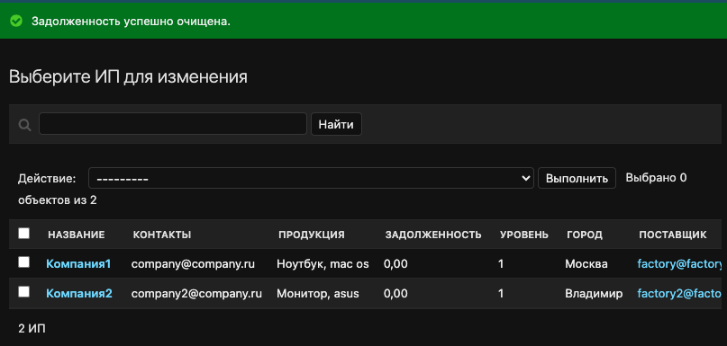

# Платформа торговой сети электроники.

*Приложение выполнено в соответствии с [условиями](README_task.md)*

---

## Реализовать модель сети по продаже электроники:

Создано 3 основных модели:
- factory (завод);
- company (ИП);
- retail (розничная сеть).

И 2 вспомогательные модели:
- contacts;
- products.

Модель Factory не может иметь поставщика, так как по умолчанию уровень объекта 0.
У модели могут быть клиенты/покупатели: Company и Retail.

Если Company закупает оборудование непосредственно у Завода, то уровень данного объекта = 1,
если через Retail, то уровень данного объекта = 2.

Аналогичная логика с Retail.

Связь моделей происходит через поле provider (ссылка на модель Contacts).

Расчет уровня сети:
```
    def save(self, *args, **kwargs):
        """Определение уровня сети"""
        if self.provider.provider_type == "Factory":
            self.level = 1
        elif self.provider.provider_type == "Retail" or self.provider.provider_type == "Company":
            self.level = 2
        else:
            raise ValidationError(
                _('Ошибка в выборе поставщика.'),
            )
        super().save(*args, **kwargs)
```

---
### Модели и поля приложения

- Factory:
  - name - название, максимальная длина 50 символов;
  - contact - связь через ForeignKey с моделью Contacts;
  - product - связь через ManyToManyField с моделью Products;
  - date_create - дата создания, автоматическое поле
  - level - уровень сети, по умолчанию 0.

- Company:
  - name - название, максимальная длина 50 символов;
  - contact - связь через ForeignKey с моделью Contacts;
  - product - связь через ManyToManyField с моделью Products;
  - provider - связь через ForeignKey с моделью Contacts для связи с поставщиком;
  - credit - задолженность перед поставщиком;
  - date_create - дата создания, автоматическое поле;
  - level - уровень сети, по умолчанию 1. Автоматический расчет через поле provider_type.

- Retail:
  - name - название, максимальная длина 50 символов;
  - contact - связь через ForeignKey с моделью Contacts;
  - product - связь через ManyToManyField с моделью Products;
  - provider - связь через ForeignKey с моделью Contacts для связи с поставщиком;
  - credit - задолженность перед поставщиком;
  - date_create - дата создания, автоматическое поле;
  - level - уровень сети, по умолчанию 1. Автоматический расчет через поле provider_type.

- Contacts:
  - email - поле email;
  - country - страна;
  - city - город;
  - street - улица;
  - house - дом;
  - provider_type - тип сети - choices field, по данному полю определяется уровень сети.

- Products:
  - title - название товара;
  - model - модель товара;
  - date_start_sell - дата страта продаж;
  - is_start_sell - поступил в продажу или нет.

---

## Вывод в админ-панели:
- Ссылка на "Поставщика"

При просмотре списка ИП или розничных сетей отображается столбец "Поставщик"


При нажатии на поставщика, перенаправляет на страницу этого поставщика


- Фильтр по названию города и по определенной страны


- "admin action", очищающий задолженность перед поставщиком у выбранных объектов


Итог admin action:



---

## Запретить обновление через API поля "Задолженность перед поставщиком"

```
    def update(self, instance, validated_data):
        """Запрет на обновление поля задолженности перед поставщиком"""
        if 'credit' in validated_data:
            raise serializers.ValidationError("Обновление задолженности перед поставщиком запрещено.")

        return super().update(instance, validated_data)
```

---

## Настроены права доступа к API так, чтобы только активные сотрудники
имели доступ к API

```
class IsActiveUser(BasePermission):
    def has_permission(self, request, view):
        if request.user.is_authenticated and request.user.is_active:
            return True
        return False
```


